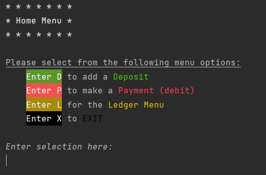
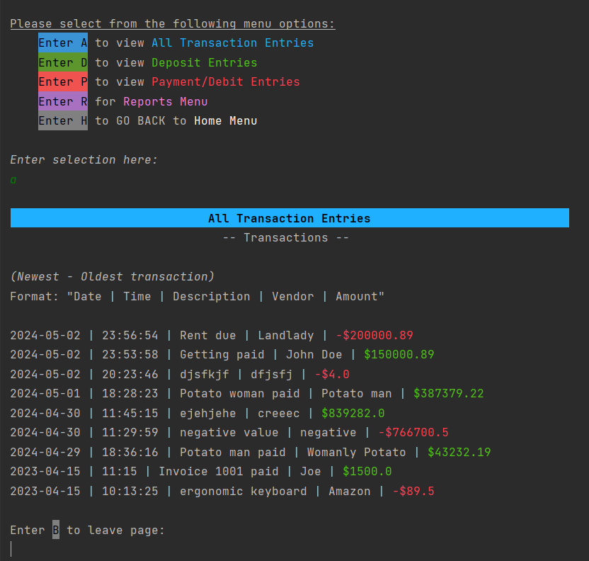

# Capstone 1: Accounting Ledger
For this project I created an application that keeps track of all financial transactions that are stored within a ``.txt`` file. The 
application allows a user to add new transactions to the system and view all transactions ever made, including the most recently added transactions.

***During the creation of my application...***
- I got stuck in a rabbit hole of trying to prevent errors from happening in my application. Everytime one popped up, I'd try to fix it. 


- Something I struggled with was... trying to get rid of the error(s) that occurred if the ``transactions.txt`` file was empty or blank.
  - I figured out that the easiest way around it was to make my methods that contained a ``BufferedReader`` ignore any blank lines that may be in the file.
    - My ``isFileEmpty()`` method will return ``false`` if the file it's reading is **not** empty/blank, and ``true`` if **it is** empty/blank.

## Screenshots of my console

------------


------------


------------


------------


------------


------------


------------


------------


------------


------------


------------


------------


------------


------------


------------


------------


------------


------------


------------


------------


***If I was given more time, I would've liked to work more on...***
- Solving more new line/whitespace errors so that my application runs more smoothly, as well as implementing more ANSI code to "spice" it up a bit more.

### One interesting piece of code
```java
private static void backButton(Scanner scanner){
    String backButton;
    
    // "Back" button
    do {
        System.out.println("\nEnter " + style.WHITE_BACKGROUND + style.BLACK + "B" + style.END_COLOR + " to leave page:");
        backButton = scanner.next();

        if (backButton.equalsIgnoreCase("B")) {
          break;
        } else {
          System.out.println("\nERROR: Must type " + style.WHITE_BACKGROUND + style.BLACK + "B" + style.END_COLOR +
          " and press 'Enter' to leave page.");
        }
    } while (!backButton.equalsIgnoreCase("B"));
}
```
- Similarly to how real-world websites or applications require you to press a button or click on "Exit" or "Back" to leave a page, the code above is a "Back" button I
created that a user MUST enter in order to leave a page. I didn't like how my application automatically went back to the most previous page or menu after a user selected 
or was done with an option. So I created ``backButton()`` to confirm that the user actually wanted to leave the current page.